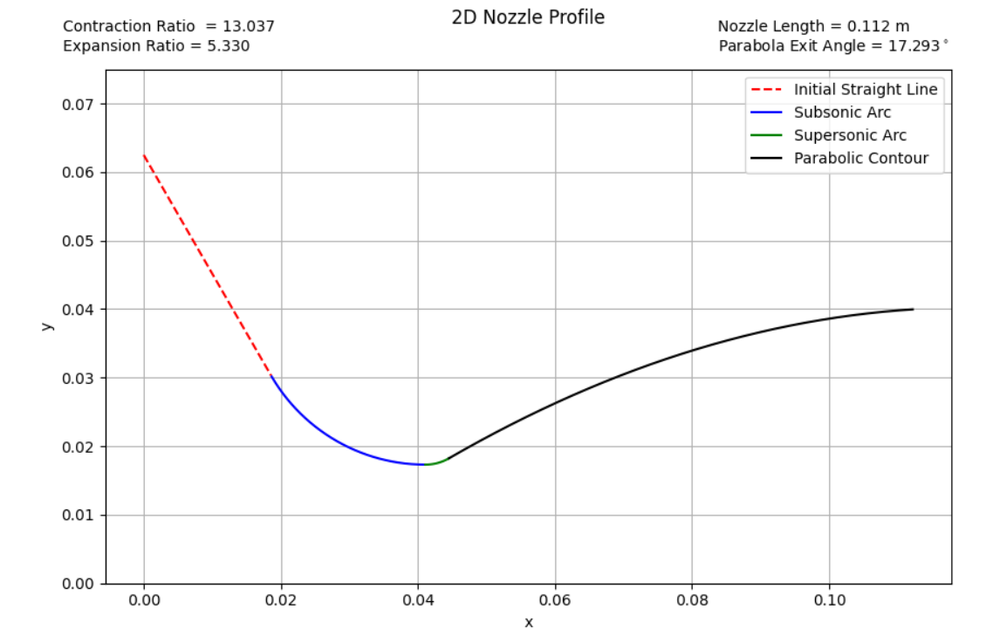
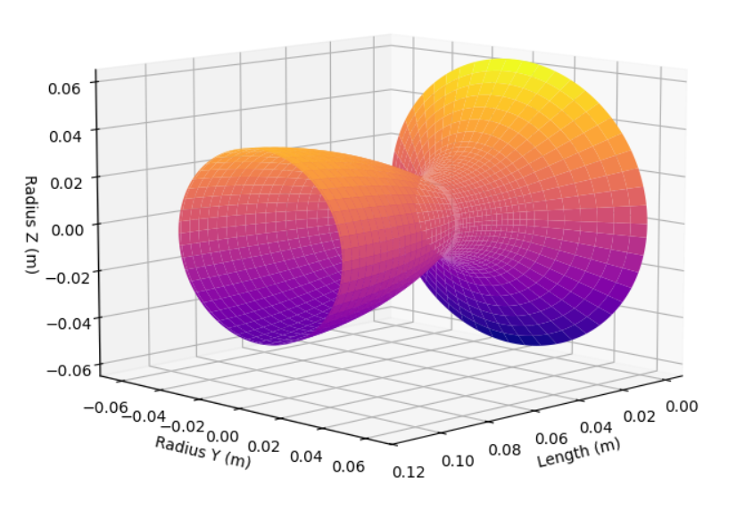
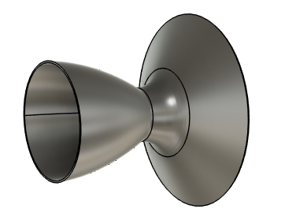
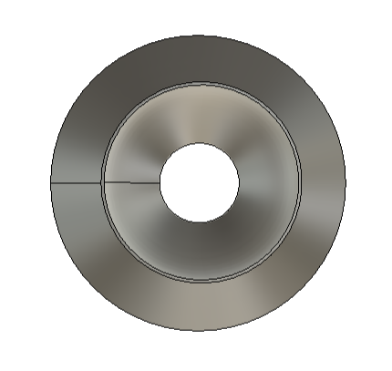
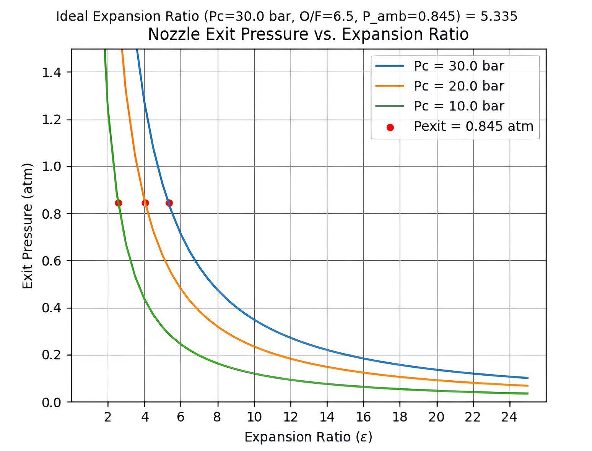
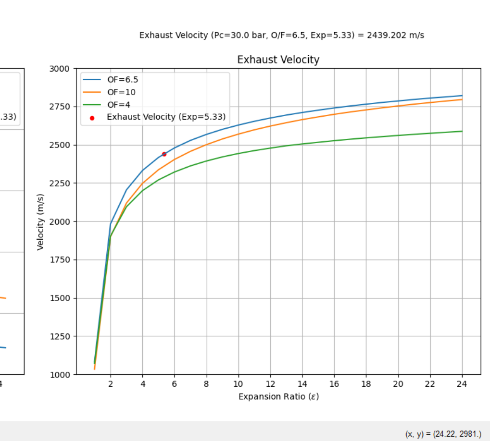

# Rocket Nozzle Geometry Simulator

This simulator was made using Python, having an interface in Java. It was developed to simulate the **ideal geometry of a rocket nozzle**. It allows the user to:

- Plot the geometry profile in a 2D graphic and preview the geometry in a 3D plot;
- Calculate the ideal throat radius;
- Plot the ideal expansion ratio to maximize thrust for various chamber pressures;
- Plot performance parameters (Specific Impulse, Thrust, Mach number, etc.) for various O/F ratios;
- Plot exhaust parameters (exhaust temperature and velocity) for different chamber pressures;
- In the 2D plot, the contraction ratio, parabola exit angle, and nozzle length are displayed on the graphic;

> Currently, the simulator has been used to design the nozzle geometry for a **hybrid rocket** using mainly **paraffin wax** as fuel and **N₂O** as oxidizer to compete at EuRock 2025 with Porto Space Team.

---

### Top contributors:

---
## 2D Geometry Plot

  

(<a href="#readme-top">back to top</a>)

---

## 3D Geometry Preview

  

(<a href="#readme-top">back to top</a>)

---

## AutoDesk Fusion Model

  

  
  

(<a href="#readme-top">back to top</a>)

---

## Getting Ideal Expansion Ratio

  

(<a href="#readme-top">back to top</a>)

---

## Performance Parameters

  

(<a href="#readme-top">back to top</a>)

---

## Exhaust Velocity

  

(<a href="#readme-top">back to top</a>)

---

## Exhaust Temperature

  

(<a href="#readme-top">back to top</a>)

---

## Thrust Analysis

  

(<a href="#readme-top">back to top</a>)

