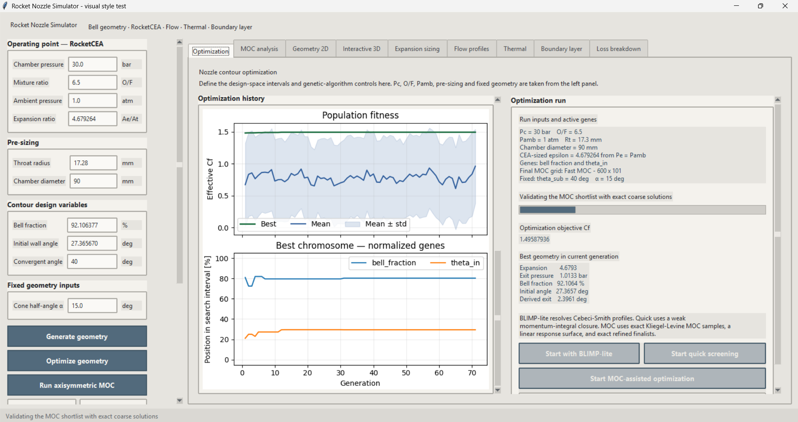
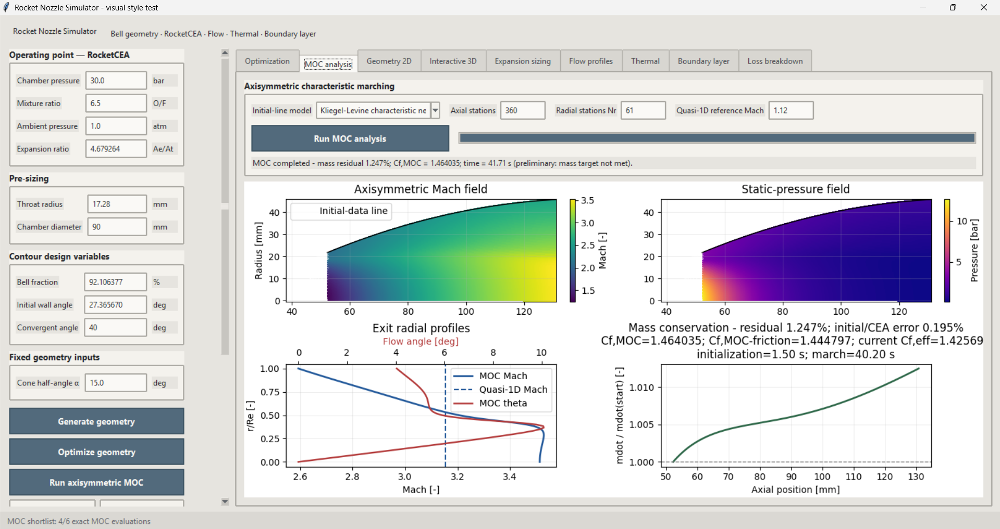
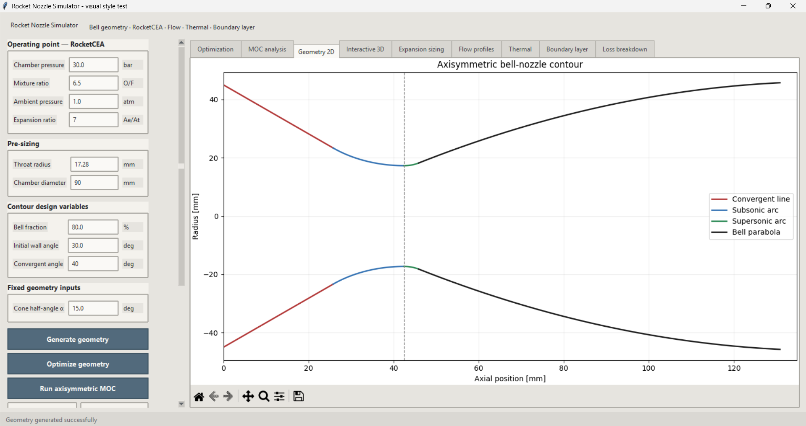
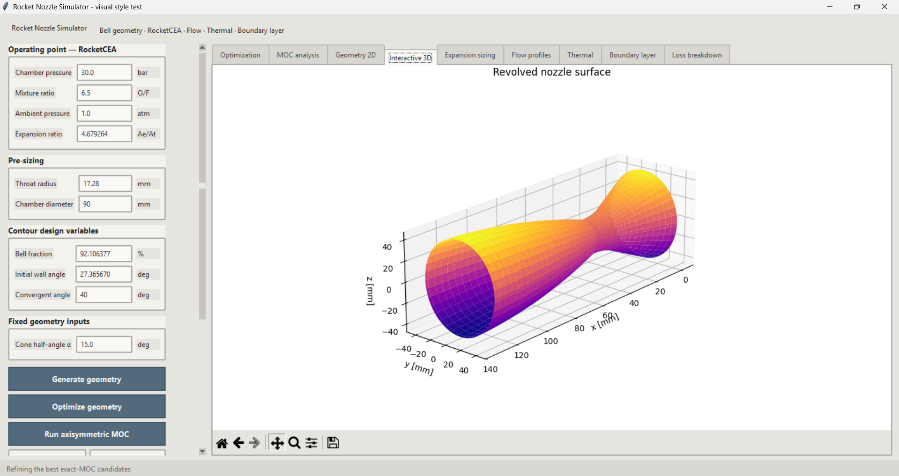
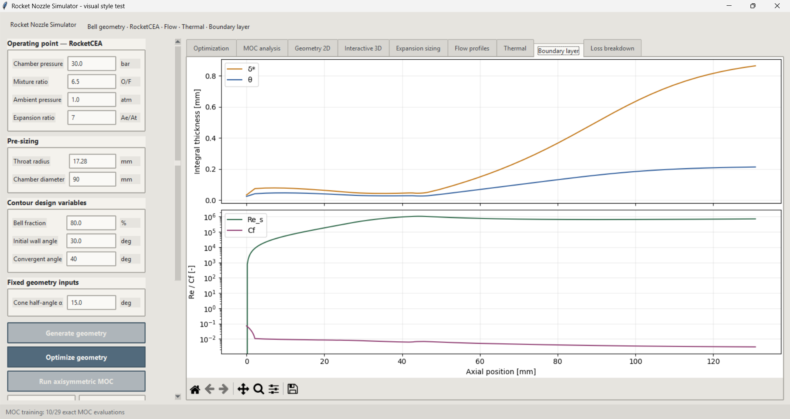
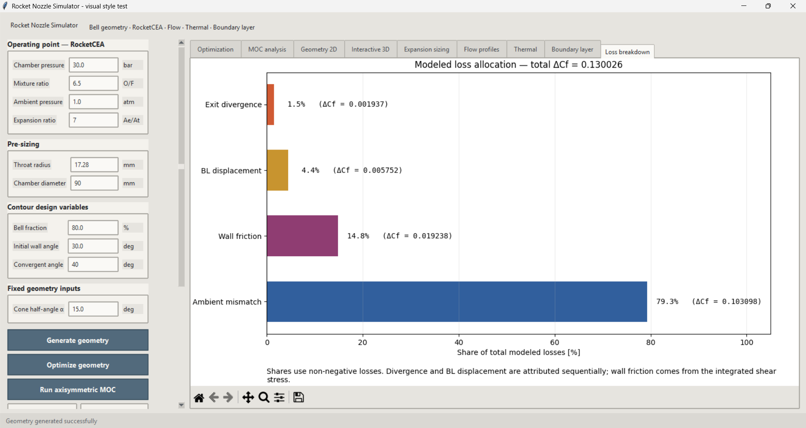
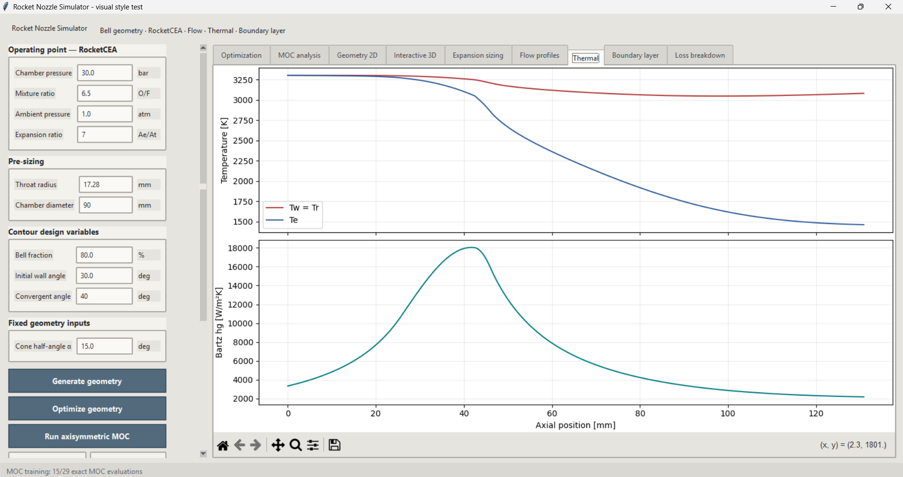

# Rocket Nozzle Simulator

[](https://www.python.org/)
[](LICENSE)
[](https://pypi.org/project/rocketcea/)

A desktop engineering tool for designing and inspecting axisymmetric bell nozzles.
It combines the original Porto Space Team nozzle geometry with RocketCEA properties,
quasi-1D flow profiles, an adiabatic BLIMP-inspired/Cebeci-Smith boundary-layer
solver and interactive 2D/3D visualization.

## Interface and Results

<p align="center">
  
  <br>
  <sub><b>Figure 4 —</b> Genetic-algorithm optimization interface and convergence results.</sub>
</p>

<p align="center">
  
  <br>
  <sub><b>Figure 6 —</b> Method of Characteristics solution and supersonic flow-field visualization.</sub>
</p>


<p align="center">
  
  <br>
  <sub><b>Figure 1 —</b> Two-dimensional nozzle geometry and flow-domain visualization.</sub>
</p>

<p align="center">
  
  <br>
  <sub><b>Figure 2 —</b> Three-dimensional visualization of the generated nozzle contour.</sub>
</p>

<p align="center">
  
  <br>
  <sub><b>Figure 3 —</b> Boundary-layer analysis interface and resulting flow quantities.</sub>
</p>


<p align="center">
  
  <br>
  <sub><b>Figure 5 —</b> Nozzle performance-loss analysis and associated contributions.</sub>
</p>


<p align="center">
  
  <br>
  <sub><b>Figure 7 —</b> Thermal analysis interface and nozzle wall heat-transfer results.</sub>
</p>

## Highlights

- One desktop interface for geometry, CEA data and engineering profiles.
- Interactive 3D nozzle view embedded in the application.
- Pressure-based axisymmetric Method-of-Characteristics analysis of the prescribed
  bell wall, with explicit `Q` and `S+/-` compatibility terms, a regular axis
  limit, mass-conservation diagnostics and exit-plane thrust integration.
- Explicit RocketCEA units: chamber pressure is entered in bar and properties are
  returned in SI-oriented units.
- Chamber, throat and exit temperature, molecular weight, gamma and transport
  properties obtained from `Pc`, O/F and expansion ratio.
- Bell fraction shown explicitly as a contour design variable.
- Exit angle derived from bell fraction and the initial wall angle.
- CSV and JSON export into a timestamped result folder.
- A single simulation API shared by the GUI and future optimization workflows.

## Quick start

### 1. Clone and enter the repository

```bash
git clone <repository-url>
cd "Genetic Algorithm with Nozzle Geo Simulator"
```

### 2. Create a virtual environment

Windows PowerShell:

```powershell
py -m venv .venv
.venv\Scripts\Activate.ps1
```

Linux/macOS:

```bash
python3 -m venv .venv
source .venv/bin/activate
```

### 3. Install and run

```bash
python -m pip install --upgrade pip
python -m pip install -r requirements.txt
python run_simulator.py
```

Alternatively, install the project as a package:

```bash
python -m pip install -e .
nozzle-simulator
```

### Experimental visual-style interface

The established Tk/ttk interface remains the default. A separate conservative
style test is available without changing its layout, tabs or engineering plots:

```bash
python run_custom_interface.py
```

or, after an editable package installation:

```bash
nozzle-simulator-modern
```

Both launchers use the same window structure and the same simulation, optimization,
MOC and export modules. The style-test version does not replace or modify the
established window.

Tkinter ships with standard Windows Python installations. On Debian/Ubuntu it may
need to be installed separately:

```bash
sudo apt install python3-tk gfortran
```

`gfortran` may be needed when RocketCEA must be built from source.

## Using the interface

Inputs are deliberately separated by responsibility:

| Group | Quantities | Role |
|---|---|---|
| Operating point | `Pc` [bar], O/F, `Pamb` [atm], `Ae/At` | Sent to RocketCEA |
| Pre-sizing | throat radius, chamber diameter | Fixed by engine sizing |
| Contour variables | `Ae/At`, bell fraction, `theta_in` | Manual geometry inputs |
| Fixed optimization geometry | `theta_sub`, cone half-angle `alpha` | User-selected convergent and reference cone |
| Thermal condition | `Tw = Tr = Taw` | Adiabatic wall; recovery is derived from local `Pr^(1/3)` |

Press **Generate geometry** after changing inputs. The right-hand tabs update together:

1. **Optimization** — GA search ranges, algorithm controls and live results.
2. **Geometry 2D** — colored contour sections and mirrored nozzle profile.
3. **Interactive 3D** — revolved surface with rotation and zoom.
4. **Expansion sizing** — CEA `Pe(ε)`, ambient pressure and ideal-expansion point.
5. **Flow profiles** — Mach, temperature and pressure.
6. **Thermal** — recovery/wall temperature and diagnostic Bartz coefficient.
7. **Boundary layer** — BLIMP-lite displacement, momentum thickness, resolved skin friction and Reynolds number.
8. **Loss breakdown** — percentage and `ΔCf` attributed to divergence, BL displacement, wall friction and ambient mismatch.

Press **Run axisymmetric MOC** for the current generated contour. The **MOC analysis**
tab exposes axial stations, radial stations (N_r), an experimental Sauer transonic
initializer and a quasi-1D reference mode for timing comparisons. (N_r) is the
number of discrete initial-line points between the symmetry axis and the throat wall.
The tab displays the
Mach and pressure fields, exit radial profiles, mass-flow residual and a direct
thrust-coefficient comparison. The same Kliegel-Levine solver can also be selected
as the GA objective through the accelerated workflow described below. Sauer uses the CEA throat molecular
weight and gamma together with the fixed (R_{c,sub}=1.5R_t) convergent arc to build
the curved supersonic initial-data line. The current fixed-x marcher samples the
Sauer field on a wholly supersonic axial plane, so this coupling remains experimental
until its mass-flow convergence target is met. The interface reports initialization,
marching and total times and does not label a result as verified when its mass-flow
residual exceeds 0.5%.

Press **Optimize geometry** to open the dedicated **Optimization** tab inside the
same main window. Set the minimum and maximum of every optimized geometry variable,
the number of generations, population, mating parents, elites, saturation limit,
crossover probability and adaptive-mutation percentages. The run panel offers three
explicit start buttons:

- **Start with BLIMP-lite** uses the resolved Cebeci–Smith profile marcher. This is
  the recommended higher-fidelity option.
- **Start quick screening** uses a deliberately weak 1/7-power, Eckert-reference
  temperature and flat-plate skin-friction closure. It is intended for rapid search,
  not final performance reporting.
- **Start MOC-assisted optimization** trains a piecewise-linear response surface
  from actual axisymmetric Kliegel-Levine MOC + BLIMP evaluations. The GA is cheap,
  then a shortlist is recalculated with exact coarse MOC and the finalists with a
  refined MOC mesh. Only an exact refined-MOC finalist can be returned as the winner.

The optimization panel exposes **Fast MOC (`600 x 101`)** and **Precise MOC
(`1200 x 201`)** as its two principal finalist presets, while retaining the
intermediate meshes as study options. For the reference case, both presets selected
exactly the same `Kb` and `theta_in`; Fast overpredicted the converged `Cf` by 0.348%
and completed in 155.5 s instead of 427.1 s. Precise is the report-quality option;
Fast is recommended for routine optimization and trend studies.
The 29-point DOE remains at `120 x 21` so changing the finalist mesh does not
multiply the training cost. The right-hand run panel has its own
vertical scrollbar, keeping all three start buttons accessible after a completed run.
The reproducible convergence study is available as:

```powershell
python -u -m examples.compare_moc_resolutions
```

The study resumes from its CSV, rejects saved solutions whose initial mass flow
differs from the RocketCEA choking reference `Pc At / c*` by more than 0.5%, and
extends the grid up to `1440 x 241` if necessary. A mesh is accepted only after
two consecutive changes in friction-corrected `Cf` below 0.1%, an entrance-to-exit
mass-flow residual below 0.5%, and an initial-flow error below 0.5%. For grids with
more than 161 radial stations, the validated Kliegel-Levine transition topology is
solved at `Nr = 161` and interpolated onto the initial plane of the finer
prescribed-wall march; the separate `Pc At / c*` check detects any unacceptable
mass-flow change introduced by that transfer.

All three options use the same genes and GA operators. BLIMP-lite and Quick winners
are regenerated with BLIMP-lite; a MOC-assisted winner is regenerated with BLIMP-lite
and receives the exact refined MOC field used for its final ranking.
`Pc`, O/F, `Pamb`, pre-sizing values, the convergent angle and the reference cone
angle remain fixed. Before every search, RocketCEA solves `Pe(epsilon) = Pamb`; this
pressure-matched expansion ratio is written back to the main input and is not a gene.
The optimizer varies:

- bell fraction `Kb = Lparab/Lcone`;
- initial divergent-wall angle `theta_in`.

The divergent length is defined directly by `Lparab = Kb Lcone`; bell fraction is
the only divergent-length parameter in both manual generation and optimization.

The exit angle `theta_out` is calculated from the resulting quadratic bell. It is
used explicitly by the divergence efficiency and indirectly by the compressible
boundary-layer integration, but it is not an independent gene.

The tab shows a tqdm-style progress indicator with generation, percentage, elapsed
time, ETA and generation rate, plus the best effective `Cf` and current best geometry.
The left optimization panel is scrollable. Below the controls it contains a fitness
plot (best, population mean and standard deviation) and a normalized trajectory plot
for both genes. During the run, the main input fields track the best chromosome
of the current generation. **Cancel** stops after the current generation and retains
that best candidate. On completion or cancellation, the selected geometry is evaluated
with BLIMP-lite; MOC-assisted runs also retain and display the refined MOC field. The
quasi-1D objective is:

```text
Cf_effective = eta_momentum * Cf_momentum + epsilon * (Pe - Pamb) / Pc - Cf_friction
eta_momentum = eta_divergence * eta_boundary_layer
Cf_momentum = CFcea returned by RocketCEA
Cf_friction = integral(2 pi r tau_w dx) / (Pc At)
```

Candidates for which RocketCEA predicts separated operation receive zero fitness.

The integrated optimizer keeps the existing PyGAD organization: tournament
selection, uniform crossover, adaptive mutation, three elites, up to 300 generations
and 100 individuals, with saturation stopping after 40 generations without progress.
The **Evaluation acceleration** panel offers persistent worker processes, serial
evaluation and threads, as well as an exact-match fitness cache. Processes are the
recommended default for the CPU-bound flow and boundary-layer calculations; every
worker receives an isolated RocketCEA working directory to avoid Fortran-file races. The GA
operators remain unchanged. Direct BLIMP-lite and Quick fitness evaluations skip the
thermal profile because it is not used by the objective. MOC-assisted mode avoids a
CEA/MOC call per chromosome: it uses 24 Latin-hypercube samples plus the design-space
centre and four corners, evaluates those samples in parallel, and uses a bounded linear
interpolant during the generations. Invalid geometry, ambient separation and signed
BLIMP wall-shear separation remain hard constraints in every exact sample. The
reported final MOC fitness and field come from exact refined validation, not from the
interpolant.
In the default case, a single Quick evaluation is approximately six times faster
than BLIMP-lite on the development machine; the exact speed-up depends on the CPU and
RocketCEA installation.

**Export results** creates:

```text
outputs/nozzle_run_YYYYMMDD_HHMMSS/
├── summary.json
├── geometry.csv
├── flow_profile.csv
├── thermal_profile.csv
└── boundary_layer.csv
```

When a MOC analysis has been run, export also creates
`moc_initial_data_line.csv`, `moc_station_diagnostics.csv`, `moc_exit_profile.csv`
and `moc_field.csv`, and adds
the MOC verification data to `summary.json`.

## Python API

The GUI and optimizers should use the same entry point:

```python
from nozzle_simulator import NozzleInputs, simulate

inputs = NozzleInputs(
    chamber_pressure_bar=30.0,
    mixture_ratio=6.5,
    ambient_pressure_atm=1.0,
    expansion_ratio=5.6,
    throat_radius_m=0.01728,
    chamber_diameter_m=0.120,
    bell_fraction=0.80,
    theta_in_deg=30.0,
    theta_sub_deg=50.0,
)

result = simulate(inputs)
print(result.geometry.theta_out_deg)
print(result.performance.effective_thrust_coefficient)
print(result.cea.chamber.temperature_k)
```

Run the included example from the repository root:

```bash
python -m examples.basic_api
```

## Repository layout

The maintained `method_of_caracteristics/` package contains the pressure-based
axisymmetric MOC solver and its numerical/thermodynamic primitives.

```text
.
├── nozzle_simulator/       # Maintained simulator package
│   ├── app.py              # Tkinter desktop interface
│   ├── cea.py              # RocketCEA configuration and properties
│   ├── geometry.py         # NozzleGeometry-derived contour
│   ├── flow.py             # Quasi-1D profiles
│   ├── thermal.py          # Adiabatic recovery and diagnostic Bartz coefficient
│   ├── boundary_layer.py   # BLIMP-lite / Cebeci-Smith profile marcher
│   ├── simulation.py       # Shared public simulation entry point
│   └── export.py           # CSV/JSON export
├── nozzle_simulator/optimization/
│   └── contour_genetic_algorithm.py  # Maintained in-window GA
├── tests/                  # Maintained simulator tests
├── examples/               # Reference example data
├── docs/                   # Model notes and images
├── legacy/
│   ├── optimization_studies/ # Archived standalone GA studies
│   └── nozzle_simulator_code/ # Preserved original simulator scripts
├── run_simulator.py        # Clone-and-run launcher
└── pyproject.toml
```

The original `NozzleGeometry.py`, `cleaned.py`, Java launcher and auxiliary scripts
are preserved under `legacy/`; the maintained application no longer depends on
their global GUI state.

## Model scope

The simulator is intended for preliminary design and comparison. It is not a
replacement for multidimensional CFD or experimental validation. See
[the model reference](docs/MODEL.md) for equations, property sources and known
limitations.

## Testing

```bash
python -m unittest discover -s tests -v
```

The integration tests execute a real RocketCEA case and validate that geometry,
flow, thermal and boundary-layer profiles are finite and aligned.

## Historical context

The project originated as a nozzle geometry tool for a paraffin/N2O hybrid rocket
developed for Porto Space Team and EuRoC. The custom paraffin card is retained in
`nozzle_simulator/cea.py` and can be replaced or extended for other propellants.

## License

Distributed under the GNU General Public License v3.0. See [LICENSE](LICENSE).
